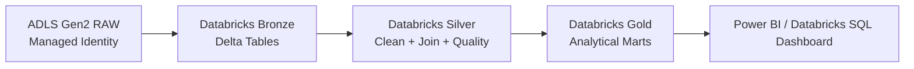
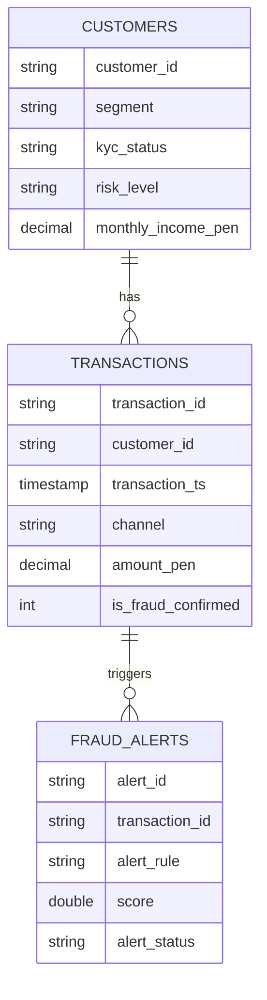

# Proyecto Final - Ingeniería de Datos con Databricks

## Tema
Plataforma analítica fintech para monitoreo de transacciones digitales, detección de riesgo y análisis de fraude.

## Objetivo
Implementar un ETL en Databricks usando arquitectura Medallion:

- **RAW**: datasets en ADLS Gen2, accedidos con Managed Identity.
- **Bronze**: ingesta cruda en Delta.
- **Silver**: limpieza, normalización, joins y reglas de calidad.
- **Gold**: marts analíticos para dashboards.

## Datasets incluidos
Los archivos de ejemplo están en `datasets/raw` para poder cargarlos al contenedor RAW de ADLS Gen2.

| Dataset | Registros | Descripción |
|---|---:|---|
| customers | 6,000 | Clientes fintech, KYC, segmento, riesgo |
| transactions | 25,000 | Transacciones digitales, canal, monto, estado |
| fraud_alerts | 7,000 | Alertas antifraude asociadas a transacciones |

## Estructura del repositorio

```text
.
├── datasets/
│   └── raw/
│       ├── customers/
│       ├── transactions/
│       └── fraud_alerts/
├── dashboard/
├── reversion/
├── .github/workflows/
├── seguridad/
├── PrepAmb/
├── proceso/
├── certificaciones/
├── evidencias/
├── docs/
├── resources/
├── databricks.yml
└── README.md
```

## Orden de ejecución

1. `PrepAmb/00_preparacion_ambiente.ipynb`
2. `proceso/01_bronze_extract.ipynb`
3. `proceso/02_silver_transform.ipynb`
4. `proceso/03_gold_load.ipynb`
5. `seguridad/04_grants.ipynb`

## Parámetros principales

| Parámetro | Ejemplo |
|---|---|
| catalog_name | fintech_lakehouse |
| bronze_schema | bronze |
| silver_schema | silver |
| gold_schema | gold |
| raw_base_path | abfss://raw@<storage-account>.dfs.core.windows.net/fintech |
| checkpoint_base_path | abfss://checkpoints@<storage-account>.dfs.core.windows.net/fintech |

# Arquitectura completa

## Vista lógica



## Capas

### RAW
Fuente externa en ADLS Gen2. La conexión se realiza con Managed Identity mediante Access Connector y Unity Catalog External Location.

### Bronze
Copia técnica en Delta Lake con columnas de trazabilidad:
- `_source_file`
- `_ingestion_ts`

### Silver
Datos confiables:
- Tipado correcto.
- Eliminación de duplicados.
- Normalización de textos.
- Reglas de calidad.
- Join de clientes, transacciones y alertas.

### Gold
Marts analíticos:
- KPIs diarios de transacciones.
- Fraude por segmento y canal.
- Perfil de riesgo por cliente.

## Modelo de datos


