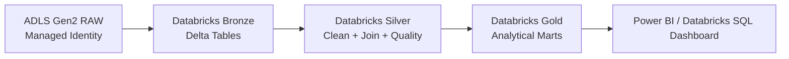
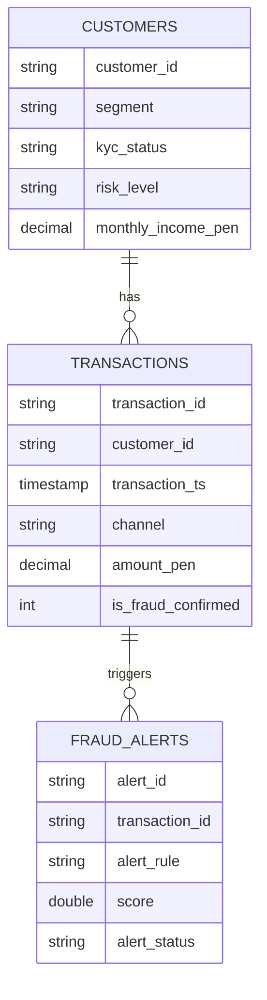

# Arquitectura completa

## Vista lógica

## Capas

### RAW
Fuente externa en ADLS Gen2. La conexión se realiza con Managed Identity mediante Access Connector y Unity Catalog External Location.

### Bronze
Copia técnica en Delta Lake con columnas de trazabilidad:
- `_source_file`
- `_ingestion_ts`

### Silver
Datos confiables:
- Tipado correcto.
- Eliminación de duplicados.
- Normalización de textos.
- Reglas de calidad.
- Join de clientes, transacciones y alertas.

### Gold
Marts analíticos:
- KPIs diarios de transacciones.
- Fraude por segmento y canal.
- Perfil de riesgo por cliente.

## Modelo de datos

